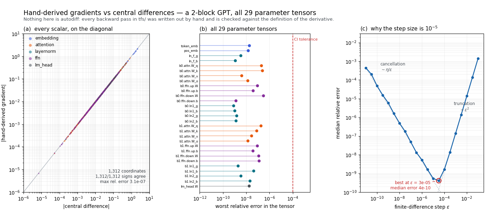
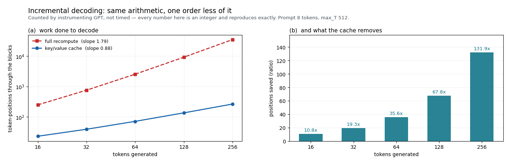
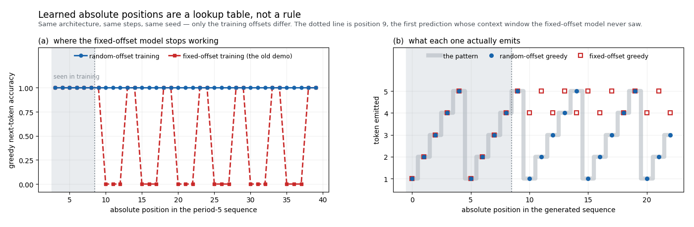

# transformer-from-scratch

[](https://github.com/superkush06/transformer-from-scratch/actions/workflows/ci.yml)
[](LICENSE)

A GPT written the long way. Every backward pass in this repository was
derived on paper and typed out as NumPy — there is no autograd, no tape,
no `.backward()`. When you read `tfs/attention.py`, you are reading the
chain rule.

Doing that is only worth anything if the derivatives are actually right,
so the centrepiece here is not the model. It is the evidence: 1,312
hand-computed partial derivatives, every one of them checked against the
definition of a derivative. `examples/gradcheck.py` sweeps all 1,312;
CI checks all 29 parameter tensors on every push, sampling coordinates
inside the large ones so the build stays under a second.



**(a)** every scalar gradient in a 2-block model, plotted against the
central difference that measures it — 1,312 points across five decades,
all on the diagonal, all with the right sign. **(b)** the worst relative
error inside each of the 29 parameter tensors; the loosest is
`blocks.0.ffn.down.W` at 3.1e-07, a factor of 330 inside the 1e-4
relative tolerance CI enforces. **(c)** why the check uses `eps = 1e-5`:
truncation error falls like ε² while floating-point cancellation grows
like η/ε, so their sum is a V whose minimum sits at ε ≈ η^(1/3) and whose
depth is ≈ η^(2/3). The *shape* is what the algebra in
[`docs/theory.md`](docs/theory.md) predicts; the *position* is close but
not equal. The sweep bottoms out at ε = 3e-05, 3.6x to the right of the
ε* ≈ 9e-6 the idealisation gives, at a median relative error of 4e-10,
11x above its η^(2/3) ≈ 4e-11 floor — the gap is the |f| and |f‴|
factors the idealisation sets to 1.

## Install

```bash
git clone https://github.com/superkush06/transformer-from-scratch.git
cd transformer-from-scratch
pip install -e ".[dev]"
pytest
```

NumPy is the only runtime dependency; matplotlib is dev-only, for figures.

## The API in one page

Forward passes return `(output, cache)`, and backward passes consume that
cache. It is more typing than a tape, and that is the point — the
computation graph is a thing you can see.

```python
>>> import numpy as np
>>> from tfs import GPT, AdamLite

>>> model = GPT(vocab_size=6, d_model=24, n_heads=3, d_ff=48,
...             n_blocks=2, max_T=8, seed=0)
>>> sum(p.data.size for p in model.params())
10080
>>> len(model.named_params())          # every one of them is grad-checked
29

>>> ids     = np.array([[1, 2, 3, 4, 5, 1, 2, 3]])
>>> targets = np.array([[2, 3, 4, 5, 1, 2, 3, 4]])
>>> logits, cache = model.forward(ids)
>>> logits.shape
(1, 8, 6)

>>> opt = AdamLite(model.params(), lr=5e-3)
>>> opt.zero_grad()
>>> model.loss_and_grads(ids, targets)   # forward + cross-entropy + backward
2.2640319260382604
>>> model.blocks[0].attn.W_q.grad.shape
(24, 24)
```

Four hundred steps later, greedy decoding on the period-5 toy task:

```python
>>> from examples.train_pattern import train
>>> trained = train(steps=400)
>>> trained.generate(np.array([1, 2, 3]), max_new=7, temperature=0.0)
array([1, 2, 3, 4, 5, 1, 2, 3, 4, 5])
```

`temperature=0` is exact greedy decoding. Negative temperatures and
out-of-vocabulary ids raise `ValueError` rather than quietly returning
something plausible.

## Every gradient, checked against the definition

`PYTHONPATH=. python3 examples/gradcheck.py` perturbs every scalar of
every tensor and compares the measured slope with the hand-derived one:

```
2-block GPT: 29 parameter tensors, 1,312 scalars, central differences at eps=1e-5

  tensor                   n   max abs err   max rel err
  ------------------------------------------------------
  token_emb               56      1.71e-08      1.88e-08
  pos_emb                 48      1.70e-08      1.50e-08
  ln_f_g                   8      3.24e-11      3.46e-09
  ln_f_b                   8      2.99e-11      1.16e-09
  blocks.0.attn.W_q       64      4.04e-11      2.05e-07
  blocks.0.attn.W_k       64      5.27e-11      2.49e-07
  blocks.0.attn.W_v       64      1.26e-09      4.12e-09
  blocks.0.attn.W_o       64      2.39e-10      1.38e-08
  blocks.0.ffn.up.W      128      5.58e-11      9.30e-08
  blocks.0.ffn.up.b       16      4.76e-11      3.96e-08
  blocks.0.ffn.down.W    128      6.00e-11      3.06e-07
  blocks.0.ffn.down.b      8      1.49e-10      1.32e-09
  blocks.0.ln1_g           8      4.02e-11      8.33e-10
  blocks.0.ln1_b           8      4.47e-11      1.05e-09
  blocks.0.ln2_g           8      3.33e-11      1.53e-09
  blocks.0.ln2_b           8      1.84e-11      1.34e-09
  blocks.1.attn.W_q       64      4.37e-11      1.87e-07
  blocks.1.attn.W_k       64      4.86e-11      8.07e-08
  blocks.1.attn.W_v       64      4.63e-11      2.91e-08
  blocks.1.attn.W_o       64      4.09e-11      1.41e-08
  blocks.1.ffn.up.W      128      4.58e-11      9.11e-08
  blocks.1.ffn.up.b       16      3.47e-11      3.84e-08
  blocks.1.ffn.down.W    128      5.00e-11      1.20e-07
  blocks.1.ffn.down.b      8      3.21e-11      1.29e-07
  blocks.1.ln1_g           8      4.12e-11      2.02e-09
  blocks.1.ln1_b           8      2.55e-11      4.42e-08
  blocks.1.ln2_g           8      1.76e-11      3.53e-09
  blocks.1.ln2_b           8      2.08e-11      2.13e-08
  lm_head.W               56      4.51e-11      1.81e-08
  ------------------------------------------------------
  every tensor          1312      1.71e-08      3.06e-07

signs agree on 1,312/1,312 coordinates
PASS (tolerance 1e-04)
```

The embedding tables show larger *absolute* errors than everything else
because their gradients are larger; relative to their own magnitude they
are as accurate as the rest. `tests/test_gradcheck.py` runs the same
check over sampled coordinates on every push, parametrised over
`GPT.named_params()` — so a parameter added to the model is grad-checked
the day it is added, not the day someone remembers to add it to a list.

## Checked against things that are not this repo

A test suite proves a library agrees with itself. The gradient check
above is better than that — a central difference knows nothing about the
backward pass it is grading — and
[`docs/validation.md`](docs/validation.md) extends the idea to ten more
claims. One command produces every number in it:

```bash
PYTHONPATH=. python3 examples/validate.py        # ~20 s
```

| claim | ours | reference | source |
| ----- | ---- | --------- | ------ |
| every parameter gradient vs central differences | `3.06e-07` rel | 0, floor ≈ 4e-11 | the definition of a derivative |
| vectorised attention vs a triple-loop implementation of the equation | `1.67e-16` abs | 0 — same function | Vaswani et al. (2017), §3.2.1 |
| logit at position ≤ t when every later token is rewritten | `0.0` | 0 exactly | the causal-mask definition |
| loss / accuracy after memorising one batch | `2.67e-06` / `1.000` | 0 / 1.000 | Karpathy (2019), "overfit a single batch" |
| `tfs.ops.gelu` vs the exact Gaussian-CDF GELU | `4.73e-04` | 0 — **does not match** | Hendrycks & Gimpel (2016) |
| LayerNorm output variance | `0.9999972221` | 1.0 — **does not match** | Ba, Kiros & Hinton (2016) |
| held-out cross-entropy on a second-order Markov source | `0.9085` nats | `0.9068` (the source itself) | Cover & Thomas, §4.2 |

Two of the eleven rows disagree, and both stay in the table. The GELU
here is the tanh approximation, so it is 4.7e-04 away from `x·Φ(x)` by
construction — and its *derivative* is exact for the function actually
implemented, which is what the gradient check confirms. LayerNorm cannot
emit unit variance because it divides by `sqrt(var + eps)`; the measured
value matches `var/(var+eps)` to 2e-16. Neither is a bug, and rounding
either one away would have made the page less useful, not more.

The last row is the one that took the most work to be able to write. The
source is a second-order Markov chain, so its entropy rate is available
in closed form and no predictor can score below it; the model lands
0.0017 nats above the oracle on the same tokens, and beats a bigram
baseline by 0.0287 nats. Of that margin, 0.0260 nats is the closed-form
edge I(X; X₋₂ | X₋₁) that any predictor looking two labels back can
claim; the remaining 0.0027 is finite-sample slack on one 4,000-label
draw, not a second source of skill. Full write-up, including why the
model appears to beat the population entropy rate and does not:
[`docs/validation.md`](docs/validation.md).

Alongside it, `tests/test_properties.py` asserts the laws rather than the
values — softmax lands on the simplex and is invariant to a constant
shift, LayerNorm's `d_x` is orthogonal to both directions the layer
discards, a batch gradient is the mean of its rows, an attention output
lies inside the convex hull of the values it may see, Adam's first step
is `-lr·sign(g)` whatever the gradient's magnitude. Each is drawn a few
hundred times from a seeded generator, so passing means the identity
held, not that a fixture did.

## Decoding without recomputing the past

`generate` keeps per-block keys and values and feeds one token per step.
This is not an approximation. With a causal mask, LayerNorm over the
feature axis and a position-wise FFN, the keys and values at positions
`≤ t` cannot depend on anything that comes after them, so the cached
tensors *are* the numbers a full forward pass would recompute. The
derivation is in [`docs/theory.md`](docs/theory.md).
`tests/test_kv_cache.py` requires the cached and recomputed logits to
agree to better than 1e-12 at every step, for greedy and for sampled
decoding alike; the worst disagreement it actually sees is 1.1e-15, or
five units in the last place of a float64.



What the cache removes is counted rather than timed. `docs/figures.py`
instruments `GPT` and records how many token-positions each decoding
strategy pushes through the block stack — an integer, identical on every
machine, and checked against the closed form
`sum_i min(prompt + i, max_T)` before the figure is drawn:

| tokens | full recompute | key/value cache | positions saved |
| -----: | -------------: | --------------: | --------------: |
|     16 |            248 |              23 |           10.8x |
|     32 |            752 |              39 |           19.3x |
|     64 |          2,528 |              71 |           35.6x |
|    128 |          9,152 |             135 |           67.8x |
|    256 |         34,688 |             263 |          131.9x |

(8-token prompt, `max_T = 512`, so nothing here slides the window.)

Wall-clock does not follow that ratio, and it would be dishonest to
imply it does — or to quote it as a tight band. On one core of an Apple
M2 (macOS 15.0.1, CPython 3.12.6, NumPy 2.3.5, laptop otherwise idle) a
4-block `d_model=128` model decoding 256 tokens took 5.0–9.4 s uncached
and 0.19–0.46 s cached over nine single attempts, a speed-up of 15x to
37x. `docs/figures.py` reports the better of two attempts per
configuration, which trims the slow tail and so reads higher: eight
consecutive runs of it printed 20.3x, 25.5x, 28.5x, 28.8x, 28.8x,
32.2x, 36.5x and 42.8x — median 29x, on full times of 3.7–6.8 s
against cached times of 0.13–0.20 s. Taken together that is **15x to
43x**, not 132x, and the high end belongs to the better-of-two number
the script prints — so running the command below can legitimately show
more than the nine-attempt range does.

Two reasons the ratio is both smaller and noisier than the position
count: a cached step still attends over the whole prefix, so its cost
is not constant, and at these sizes much of what is left is Python and
NumPy call overhead that the cache does not touch — overhead that
shares the machine with everything else running on it.
`PYTHONPATH=. python3 docs/figures.py` prints your own numbers rather
than asking you to trust these.

The cache has one honest failure mode, and it is instructive. Position
embeddings here are *learned and absolute*, so the moment the context
window slides past `max_T`, every surviving token is assigned a new
position id and the whole cache becomes invalid. `generate` detects that
and rebuilds. The cost belongs to absolute positions rather than to
caching, and it is one of the quieter arguments for relative schemes.

## What the loss will not tell you

An earlier version of this repo trained its demo on a single fixed
window. It reached a training loss of 0.0005 and generated `…,5,4,5,4`.
The loss was not lying about the objective; the objective was the wrong
one. With one window, the cheapest way to reach zero loss is a
position → token lookup table, and that table is valid for exactly one
phase alignment.



Teacher-forcing the true sequence through both models and recording
greedy next-token accuracy at each position makes the failure legible:

```
 positions  fixed-offset  random-offset
       3-8          1.00           1.00
      9-39          0.42           1.00
```

Position 9 is the first prediction whose context window the fixed-offset
model never saw in training, and that is exactly where it falls off the
cliff. The oscillation afterwards is phase error drifting in and out of
alignment — not partial knowledge. Sampling training windows at random
offsets removes the shortcut, and `tests/test_generalization.py` keeps it
removed: greedy generation must reproduce the pattern exactly for 20
tokens past the training window.

Full write-up: [`docs/positional-generalization.md`](docs/positional-generalization.md).

## Where this sits

This is the deep-learning-internals layer of a group of small NumPy
libraries. It shares its premise with **tinydiff**, which builds a
reverse-mode autodiff engine and then lets the tape write the backward
pass; here the tape is removed and the same derivatives are written out
by hand, which is a worse way to build a model and a better way to
understand one.

It is also rarely the whole pipeline. Upstream, something turns a
continuous series into discrete labels — a Gaussian HMM decoded with
Viterbi, of the kind **regimes** implements. Downstream, something wants
a distribution over the next label rather than a point forecast: a sizing
rule (**kelly-bet**) or a tail-risk model (**risk**).

`examples/regime_handoff.py` is that middle stage, worked end to end and
self-contained — it imports nothing but `tfs`, and inlines the upstream
source as a second-order Markov chain over four labels (calm/stressed
crossed with up/down). Inlining it is what makes the example checkable:
the chain's conditional distribution and entropy rate are closed forms,
so the example can grade itself instead of just running.

```
held-out cross-entropy, nats/label (lower is better)
  uniform over 4 labels                  1.3863
  order-1 entropy H(X|X-1)   [closed]    0.9563
  bigram MLE, fitted + scored            0.9372
  this model                             0.9085
  oracle: the source itself              0.9068
  entropy rate H(X|X-1,X-2)  [closed]    0.9303

total variation to the true conditional, over all 16 contexts
  max 0.0864   mean 0.0489   stationary-weighted mean 0.0351
```

Total variation is the number that matters to whatever comes next: it
bounds how wrong any bounded decision rule built on the distribution can
be. The training loss does not.

## Layout

| path | what is in it |
| ---- | ------------- |
| `tfs/ops.py` | softmax, LayerNorm, GELU, cross-entropy (`logits − logsumexp`, no epsilon fudge) with hand-derived backwards |
| `tfs/attention.py` | causal multi-head attention: manual backward, plus the cached single-token path |
| `tfs/layers.py` | `Linear`, `FFN`, pre-norm `TransformerBlock` |
| `tfs/model.py` | `GPT` — `forward`, `loss_and_grads`, `named_params`, `generate` |
| `tfs/train.py` | `AdamLite`, Adam with bias correction |
| `docs/theory.md` | the equations, and the backward formulas people get wrong |
| `docs/validation.md` | eleven claims against outside references, including the two that disagree |
| `docs/figures.py` | regenerates all three figures above from a cold start |
| `examples/gradcheck.py` | the exhaustive 1,312-scalar sweep |
| `examples/validate.py` | produces every number in `docs/validation.md` |
| `examples/regime_handoff.py` | the worked hand-off: labels in, a scored distribution out |
| `tests/test_properties.py` | randomised invariants — the laws, not the values |

Everything regenerates from a cold start. The figures are deterministic —
fixed seeds, counted operations rather than wall-clock — so re-running
this on the same matplotlib writes byte-identical PNGs, and a figure that
has drifted from the script that draws it shows up as a dirty working
tree:

```bash
PYTHONPATH=. python3 docs/figures.py          # all three figures, ~15 s
PYTHONPATH=. python3 examples/validate.py     # the validation table, ~20 s
```

## What this is not

- **Not fast.** float64 NumPy, no GPU, no fused kernels. Everything is
  small on purpose: the toy tasks train in seconds, and the biggest model
  in the repo is the 0.9M-parameter one the decode benchmark uses. The
  backward pass allocates freely — legibility beat speed every time the
  two disagreed.
- **Not a training stack.** No dropout, no weight decay, no
  learning-rate schedule, no gradient clipping, no checkpointing.
- **Attention is quadratic in memory** — the full `(B, h, T, T)` score
  matrix is materialised, masked, and kept for the backward pass.
- **No weight tying, no BPE, no `ignore_index`.** Token ids go in as
  integers; padding is your problem.
- **`max_T` is a hard ceiling.** Learned absolute positions do not
  extrapolate, which the case study above measures rather than asserts.

Next, in rough order of how much there is to learn from writing them:
weight tying between `token_emb` and `lm_head` (the interesting part is
the summed gradient — a scatter-add and a dense outer product landing in
one `.grad`), a BPE tokenizer, and flash-attention-style tiling so the
score matrix is never materialised at all.

## License

MIT — see [LICENSE](LICENSE).
